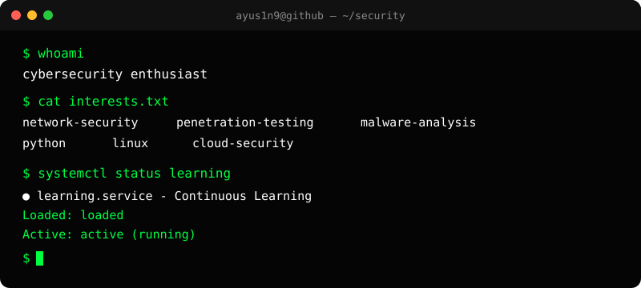
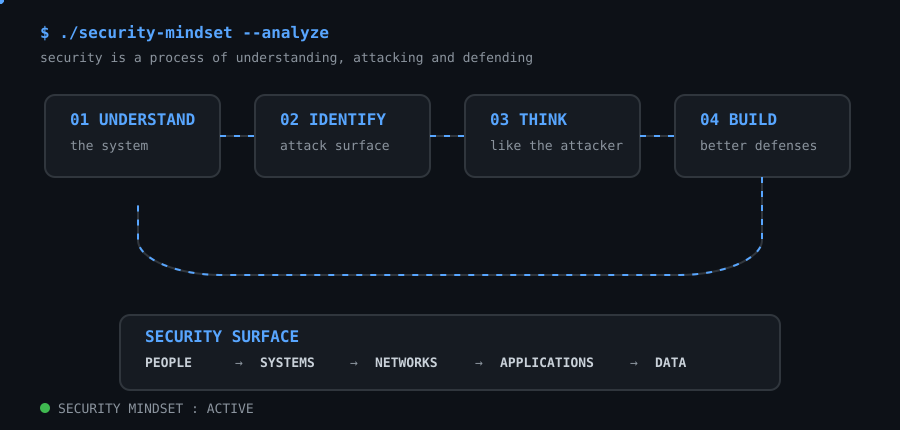

<!-- ========================================================= -->
<!--                    CYBERSECURITY README                    -->
<!-- ========================================================= -->

<div align="center">

# `> whoami`


<br>


**Cybersecurity • Network Security • Offensive Security • Python • Linux • Cloud**

[](https://github.com/ayus1n9)
[](https://www.python.org/)
[](https://www.linux.org/)
[](#)
[](#)

</div>

<div align="center">



</div>

---

# `01 // ABOUT ME`

```text
┌──────────────────────────────────────────────────────────────┐
│ $ whoami                                                     │
│                                                              │
│ Cybersecurity-focused developer and security enthusiast      │
│ interested in understanding how systems, networks and        │
│ applications actually work underneath the surface.           │
│                                                              │
│ I learn by building, breaking, analyzing and rebuilding      │
│ systems in controlled environments.                          │
└──────────────────────────────────────────────────────────────┘
```

---

# `02 // TECH STACK`

### 🐍 Programming & Scripting


### 🌐 Web Development


### ⚙️ APIs & Backend


### ☁️ Cloud & Infrastructure


### 🔄 DevOps & Automation


### 🌐 Networking

```text
TCP/IP        IPv4 / IPv6        DNS
DHCP          HTTP/HTTPS         SSH
FTP           SMTP/POP/IMAP      Routing
Firewalls     Proxies            VPN
```
### 🛡️ Security Tools


```text
[ RECON / NETWORK SECURITY ]
Nmap • Wireshark • tcpdump • Netcat
Masscan • Amass • RustScan
Proxychains • Bettercap • NetCut
Aircrack-ng

[ WEB / API / APPLICATION SECURITY ]
Burp Suite • OWASP ZAP
Nuclei • Nikto • SQLMap
Metasploit • ffuf

[ VULNERABILITY MANAGEMENT ]
Nessus • OpenVAS / Greenbone
Qualys • Nuclei • Trivy
Lynis

[ IDENTITY / WINDOWS SECURITY ]
BloodHound • Mimikatz
Impacket • CrackMapExec
Responder • PowerShell
Active Directory Security

[ PASSWORD / CREDENTIAL SECURITY ]
Hashcat • John the Ripper
Hydra • SecLists

[ MALWARE / REVERSE ENGINEERING ]
Ghidra • Cutter • IDA
x64dbg • GDB
PEStudio • PE-Bear
Cuckoo • REMnux
FakeNet-NG • Regshot

[ FORENSICS / INCIDENT RESPONSE ]
Autopsy • Volatility
Sysinternals • Procmon
Velociraptor

[ SIEM / DETECTION / SOC ]
Splunk • Wazuh • ELK Stack
Suricata • Snort • Zeek
Microsoft Sentinel

[ CLOUD SECURITY ]
Prowler • ScoutSuite
AWS CloudTrail • AWS GuardDuty
Microsoft Defender for Cloud
Google Security Command Center

[ THREAT INTELLIGENCE ]
MITRE ATT&CK • Maltego
MISP • YARA
VirusTotal

[ CONTAINER / DEVSECOPS ]
Trivy • kube-bench
Docker Security • Kubernetes Security
```

### 🐧 Platforms & Environments

```text
Linux → Ubuntu • Kali Linux • REMnux • BlackArch

Windows → Security & Administration

Virtualization → VirtualBox • VMware

Containers → Docker

Subsystem → WSL2
```

---

# `03 // GITHUB`

<div align="center">


<br>


</div>

---

# `04 // CONTRIBUTIONS`

<div align="center">

<picture>
  <source media="(prefers-color-scheme: dark)" srcset="https://raw.githubusercontent.com/ayus1n9/ayus1n9/output/github-contribution-grid-snake-dark.svg">
  <source media="(prefers-color-scheme: light)" srcset="https://raw.githubusercontent.com/ayus1n9/ayus1n9/output/github-contribution-grid-snake.svg">
  
</picture>

</div>

---

# `05 // SECURITY MINDSET`

<p align="center">
  
</p>

> **Understand the system → Identify the attack surface → Think like the attacker → Build better defenses.**

---

# `06 // CONNECT`

<div align="center">

### Let's talk about

`Cybersecurity` • `Networking` • `CTFs` • `Python` • `Linux` • `Cloud` • `Security Research`

<br>

[](https://linkedin.com/in/ayus1ngh)
[](https://github.com/ayus1n9)
[](mailto:singhayush0919@gmail.com)

</div>

---

<div align="center">


### `> connection_established`

```text
STATUS : ONLINE
MODE   : LEARNING
FOCUS  : SECURITY
MISSION: UNDERSTAND • BUILD • BREAK • SECURE
```

**⚡ Keep learning. Keep building. Keep questioning.**

</div>

